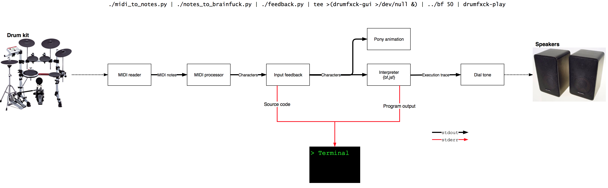

# Drumfxck
### Drumfxck: the drumming based programming language.

A collection of programs that combine to process MIDI input as [Brainfuck](https://en.wikipedia.org/wiki/Brainfuck), interpret it, and use the interpreter execution as input into an audio/visual output.

##### drumfxck/midi_to_notes.py
Script to read input from the first attached MIDI instrument. Depends on the Python [mido](https://mido.readthedocs.io/en/latest/) library, installable via pip.

Note that if there are problems getting input, check to see that the desired device is listed when `mido.get_input_names()`
and if the desired device isn't the first one, specify the name as the argument to `mido.open_input()` on the line in `main()`. This file also handles the EOF note, so change it to suit your MIDI instrument as needed.

##### drumfxck/notes_to_brainfuck.py
Script to read processed notes and output brainfuck with correction character '~', which should be interpreted as a backspace.
The mapping from note -> brainfuck lives here.

##### bf
Brainfuck interpreter. Program output is sent to standard error and execution state is send to standard output.

The first command line argument is delay between commands in milliseconds.

##### drumfxck-play
Program to play audio from BF interpreter.

##### drumfxck-gui
Program that displays an animated Pinkie Pie playing her drum kit in response
to Brainfuck instructions for a fun visual display! Brainfuck instructions
are passed to this on stdin.

Full credit for the models and animations go to [CreatorOfPony](http://creatorofpony.deviantart.com/art/Awesome-As-I-Want-To-Be-519619119).
We only rendered them for our own angle.

## Requirements

 - Python 3
 - CMake
 - simpleaudio
 - numpy
 - mido
 - pygame

### Equipment

Drumfxck was mapped according to the Yamaha DTXIV. The mappings can easily be changed to suit any midi instrument in notes_to_brainfuck.py and escape sequence in midi_to_notes.py

To use Dan's drums: download & install Roland UM-ONE mx2 driver.

## Setup

```
pip3 install simpleaudio numpy mido pygame
python3 setup.py develop
cmake .
make
```

## Run
```
cd drumfxck
```

Without GUI:
```
./midi_to_notes.py | ./notes_to_brainfuck.py | ./feedback.py | ../bf 100 | drumfxck-play
```

With GUI:
```
./midi_to_notes.py | ./notes_to_brainfuck.py | ./feedback.py | tee >(drumfxck-gui >/dev/null &) | ../bf 100 | drumfxck-play
```

## Diagram


